# **Traffic Sign Recognition** 

---

**Build a Traffic Sign Recognition Project**

The goals / steps of this project are the following:
* Load the data set (see below for links to the project data set)
* Explore, summarize and visualize the data set
* Design, train and test a model architecture
* Use the model to make predictions on new images
* Analyze the softmax probabilities of the new images
* Summarize the results with a written report

## Rubric Points

Here I will consider the [rubric points](https://review.udacity.com/#!/rubrics/481/view) individually and describe how I addressed each point in my implementation.  

---

### Data Set Summary & Exploration

I used the pandas library to calculate summary statistics of the traffic
signs data set:

* The size of training set is ? 34799
* The size of the validation set is ? 4410
* The size of test set is ? 12630
* The shape of a traffic sign image is ? 32x32x3
* The number of unique classes/labels in the data set is? 43

Here is an exploratory visualization of the data set. It is a bar chart showing how the data is distributed across classes.  

  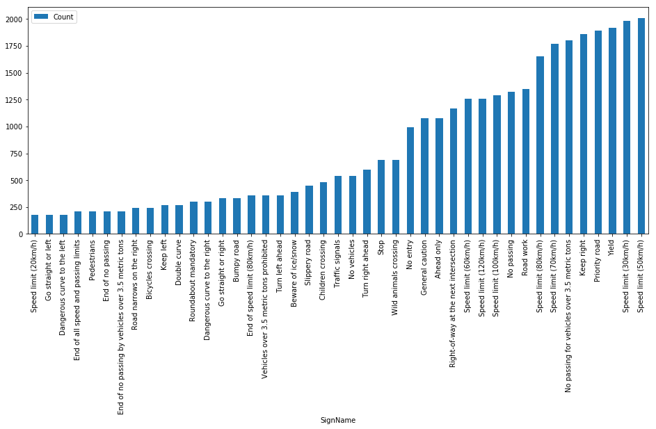

### Design and Test a Model Architecture

**1. Describe how you preprocessed the image data. What techniques were chosen and why did you choose these techniques? Consider including images showing the output of each preprocessing technique. Pre-processing refers to techniques such as converting to grayscale, normalization, etc. (OPTIONAL: As described in the "Stand Out Suggestions" part of the rubric, if you generated additional data for training, describe why you decided to generate additional data, how you generated the data, and provide example images of the additional data. Then describe the characteristics of the augmented training set like number of images in the set, number of images for each class, etc.)**

As a first step, I decided to convert the images to YUV space and extracted only the Y channel. Then I applied global contrast normalization. Both of these steps were inspired by Yann LeCun's paper. 

Here are 3 examples of an original image and an augmented image:

  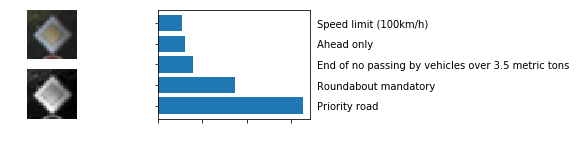
  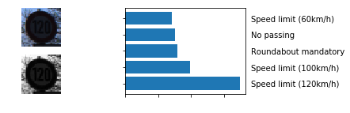
  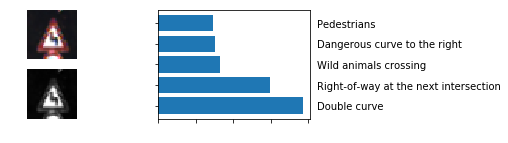

**2. Describe what your final model architecture looks like including model type, layers, layer sizes, connectivity, etc.) Consider including a diagram and/or table describing the final model.**  

My final model consisted of the following layers:

| Layer         		|     Description	        					| 
|:---------------------:|:---------------------------------------------:| 
| Input         		| 32x32x1 RGB image   							| 
| Convolution 5x5     	| 1x1 stride, same padding, outputs 32x32x32 	|
| RELU					|												|
| Max pooling	      	| 2x2 stride,  outputs 16x16x32 				|
| Dropout 0.9  	      	|												|
| Convolution 5x5     	| 1x1 stride, same padding, outputs 16x16x64 	|
| RELU					|												|
| Max pooling	      	| 2x2 stride,  outputs 8x8x64   				|
| Dropout 0.8  	      	|												|
| Convolution 5x5     	| 1x1 stride, same padding, outputs 8x8x128 	|
| RELU					|												|
| Max pooling	      	| 2x2 stride,  outputs 4x4x128  				|
| Dropout 0.7  	      	|												|
| Fully connected		| 1000        									|
| Dropout 0.5  	      	|												|
| Fully connected		|  500        									|
| Dropout 0.5  	      	|												|
| Softmax				| etc.        									|

**3. Describe how you trained your model. The discussion can include the type of optimizer, the batch size, number of epochs and any hyperparameters such as learning rate.**  

To train the model, I used an ....

**4. Describe the approach taken for finding a solution and getting the validation set accuracy to be at least 0.93. Include in the discussion the results on the training, validation and test sets and where in the code these were calculated. Your approach may have been an iterative process, in which case, outline the steps you took to get to the final solution and why you chose those steps. Perhaps your solution involved an already well known implementation or architecture. In this case, discuss why you think the architecture is suitable for the current problem.**

My final model results were:
* training set accuracy of ?
* validation set accuracy of 0.93 
* test set accuracy of ?

**If an iterative approach was chosen, what was the first architecture that was tried and why was it chosen?**  

Started off by building a baseline model borrowing from the LeNet architecture.  

  

**What were some problems with the initial architecture?**  

Poor accuracy, reaching at max 80% accuracy.  

**How was the architecture adjusted and why was it adjusted? Typical adjustments could include choosing a different model architecture, adding or taking away layers (pooling, dropout, convolution, etc), using an activation function or changing the activation function. One common justification for adjusting an architecture would be due to overfitting or underfitting. A high accuracy on the training set but low accuracy on the validation set indicates over fitting; a low accuracy on both sets indicates under fitting.**

**Which parameters were tuned? How were they adjusted and why?**

Dropout was tuned.  

**What are some of the important design choices and why were they chosen? For example, why might a convolution layer work well with this problem? How might a dropout layer help with creating a successful model?**

**How does the final model's accuracy on the training, validation and test set provide evidence that the model is working well?**

Generalized well on the test accuracy. 

### Test a Model on New Images

**1. Choose five German traffic signs found on the web and provide them in the report. For each image, discuss what quality or qualities might be difficult to classify.**

Here are six German traffic signs that I found on the web:

  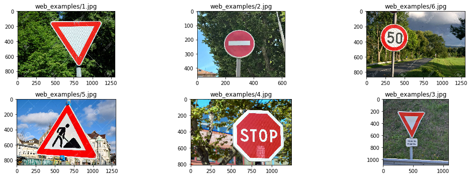

All of these might be difficult to classify since they're generally offcenter and at angles.  

**2. Discuss the model's predictions on these new traffic signs and compare the results to predicting on the test set. At a minimum, discuss what the predictions were, the accuracy on these new predictions, and compare the accuracy to the accuracy on the test set (OPTIONAL: Discuss the results in more detail as described in the "Stand Out Suggestions" part of the rubric).**  

Here are the results of the prediction:

| Image					|Prediction										| 
|:---------------------:|:---------------------------------------------:| 
| Yield					| Yield											| 
| No Entry				| 70 km/h 										|
| 50 km/h 				| End of no passing								|
| Road Work 			| Road work						 				|
| Stop 					| Traffic signals 								|
| Yield 				| Yield											|

The model was able to correctly guess 2 of the 6 traffic signs, which gives an accuracy of 33%. This compares very unfavorably to the accuracy on the test set of 83%.  

**3. Describe how certain the model is when predicting on each of the five new images by looking at the softmax probabilities for each prediction. Provide the top 5 softmax probabilities for each image along with the sign type of each probability.** 

  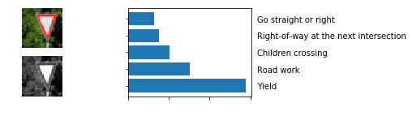

  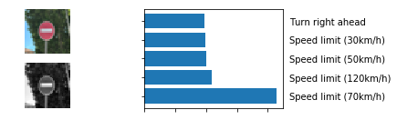

  
  

  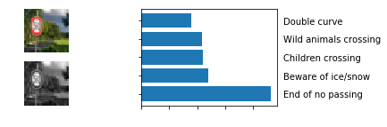

  
  

  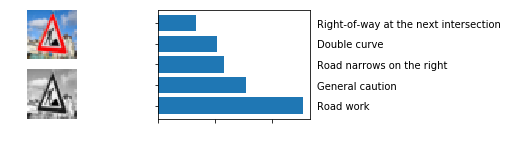

  

  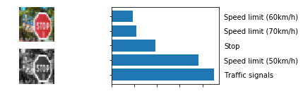

  

  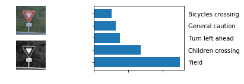

